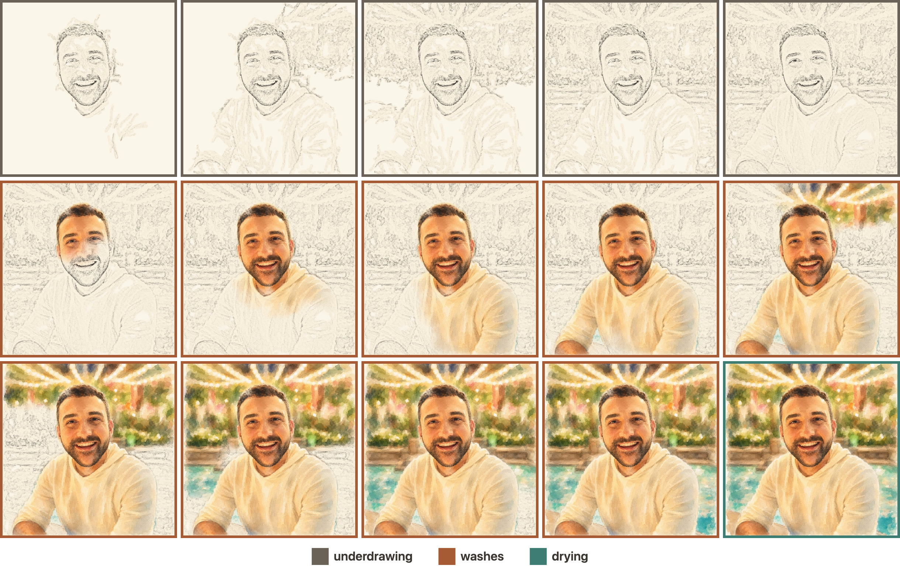
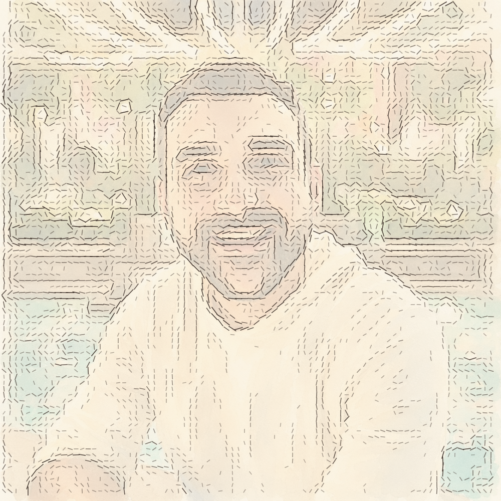
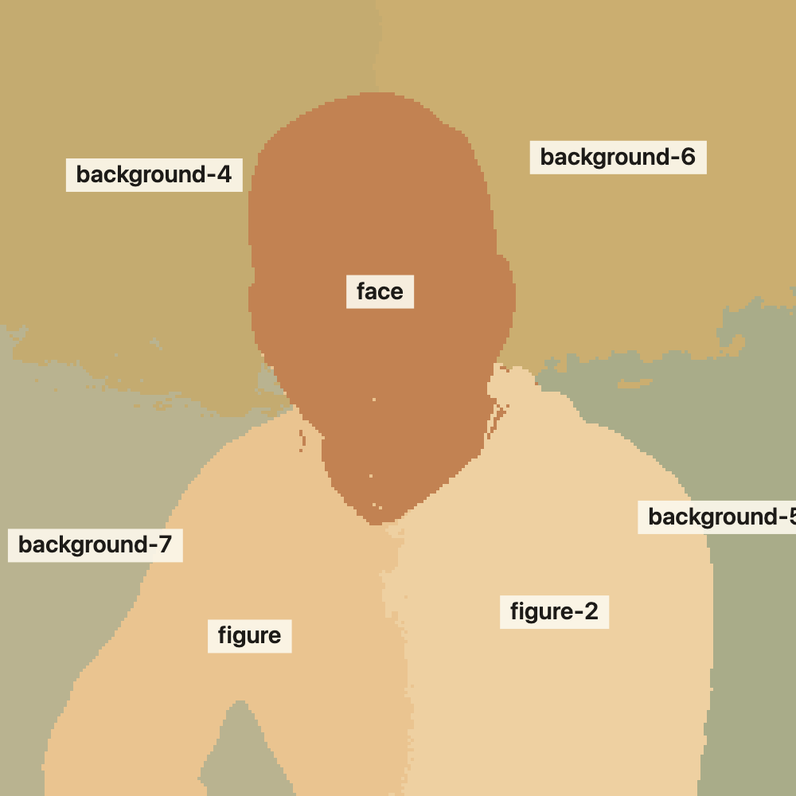
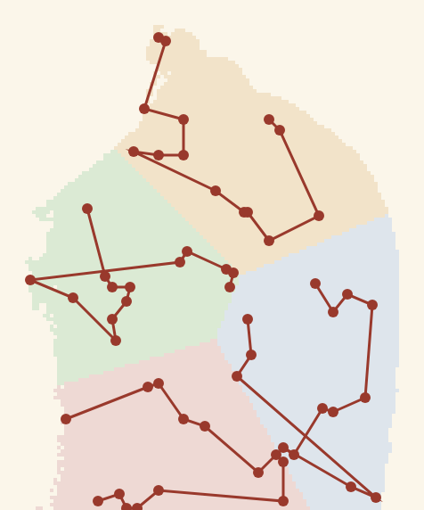

<p align="center">
  
</p>

# autoportrait

**autoportrait** renders an image as a timed painting performance on an HTML
canvas: a graphite underdrawing traced along the image's edge field, then
watercolor washes applied region by region in a configurable order. Analysis
runs entirely client side, the full stroke plan is computed before the first
frame, and a seeded PRNG makes every performance reproducible and seekable.
There are no dependencies and no runtime ML.

I love timelapses of painters at work, and I wondered whether the effect
could be replicated in software: the underdrawing going down first, the
washes pooling, the subject finished before the world behind it. The visual
style is modeled on the sketch-then-color announcement portraits
[Niklas Elmehed paints for the Nobel Prizes](https://physicsworld.com/a/meet-the-artist-behind-the-nobel-portraits-how-to-avoid-nobelitus/).
I built the engine for [my personal site](https://philipweiss.net), where it
paints my portrait for each visitor. The animation above plays at the real
speed of the default configuration, about 48 seconds.

[Playground](https://philipweiss.net/autoportrait/) ·
[Usage](#usage) ·
[Options](#options) ·
[Choreography](#choreography) ·
[How it works](#how-it-works)

## Features

- **Deterministic.** A seed reproduces a painting stroke for stroke. `seek(t)`
  rebuilds the canvas at any instant.
- **Automatic segmentation.** k-means in CIELAB with spatial weighting, plus
  heuristic labels (`face`, `figure`, `sky`, `water`, `dark`, `warm`) that the
  ordering options understand.
- **Choreography control.** Presets, an explicit region order, focus points,
  or a callback over the full stroke plan.
- **Optional figure mask.** With a subject mask, figure and background paint
  on separate layers and the background can arrive behind a finished subject.
  A one-command script generates the mask.
- **Events.** Caption, progress, and ready callbacks for building UI around
  the performance.

## Installation

Not on npm yet. Install from GitHub, or vendor `src/` (plain ES modules, no
build step):

```bash
npm install github:philipfweiss/autoportrait
```

## Usage

```html
<canvas id="c"></canvas>
<script type="module">
  import { paint } from "autoportrait";

  const painting = paint(document.getElementById("c"), {
    image: "me.jpg",
    mask: "me-mask.png", // optional, see tools/make_mask.py
    seed: 42,
  });
</script>
```

The returned object exposes `pause()`, `resume()`, `seek(t)`, `repaint()`,
`finish()`, `palette()`, `dispose()`, and a `ready` promise.

Input quality notes:

- The engine performs the input's pixels without restyling them. Any image
  works, and plain photographs come out respectably, since the sketch and the
  region-by-region reveal carry the effect. Input that already looks like
  watercolor looks the best. See [preparing the input](#preparing-the-input).
- `prefers-reduced-motion` visitors get the finished painting immediately
  (configurable via `respectReducedMotion`).

## Options

| option                 | default         | description                                                  |
| ---------------------- | --------------- | ------------------------------------------------------------ |
| `image`                | required        | URL, `HTMLImageElement`, or `ImageBitmap`                    |
| `mask`                 | none            | figure mask (white subject on black); enables layered reveal |
| `seed`                 | random          | reproduces a performance exactly                             |
| `preset`               | `"portraitist"` | `"portraitist"`, `"landscapist"`, or `"printmaker"`          |
| `order`                | none            | array of region names/tags; overrides the preset ordering    |
| `focus`                | none            | `[{x, y}]` in canvas fractions; regions paint by distance    |
| `plan`                 | none            | `(plan) => plan` callback over the final stroke schedule     |
| `tempo`                | `1`             | global speed multiplier                                      |
| `acts.sketch`          | `13`            | seconds of underdrawing; `0` skips it                        |
| `acts.wash`            | `30`            | seconds of watercolor                                        |
| `acts.dry`             | `2.4`           | seconds of drying at the end                                 |
| `brushes.big`          | `110`           | wet-pass stamp radius, canvas px                             |
| `brushes.small`        | `55`            | refining-pass stamp radius                                   |
| `regions.k`            | `7`             | target cluster count for segmentation                        |
| `paper`                | `"#fbf6ea"`     | background color                                             |
| `resolution`           | `1000`          | internal long-edge resolution                                |
| `autostart`            | `true`          | paint on load, or wait for `.play()`                         |
| `respectReducedMotion` | `true`          | reduced-motion visitors get the finished frame               |
| `onCaption`            | none            | `(text, phase)` narration events                             |
| `onProgress`           | none            | `(t, total)` per frame                                       |
| `onReady`              | none            | `({seed, regions})` after analysis                           |

## Choreography

Four mechanisms control paint order, from coarse to fine.

**Presets.** `portraitist` paints subject regions first and revisits the face
with small brushes at the end. `landscapist` paints background regions first.
`printmaker` completes the entire underdrawing, then applies washes ordered by
lightness.

```js
paint(canvas, { image, preset: "landscapist" });
```

**Region order.** Names and tags from the segmentation, painted in the order
listed. Unlisted regions follow.

```js
paint(canvas, { image, mask, order: ["figure", "face", "sky", "background"] });
```

**Focus points.** Regions and sub-areas paint in order of distance from the
nearest point.

```js
paint(canvas, { image, focus: [{ x: 0.3, y: 0.6 }] });
```

**Plan callback.** Receives the computed schedule (an array of stroke groups
with times, kinds, clip layers, and region names) before playback. Whatever it
returns is what plays.

```js
paint(canvas, {
  image,
  plan(p) {
    p.groups.reverse();
    return p;
  },
});
```

## How it works

The pipeline has three phases: analysis (what does the image contain),
planning (every mark and its timestamp), and playback (replay the plan
against a clock). Because planning happens up front, seeking and
reproducibility come for free.

<p align="center">
  
</p>

### 1. Underdrawing

The sketch layer is color dodge: luminance $L(x,y)$ divided by a blurred
inverse of itself,

$$
S(x,y) = \min\left(255,\; \frac{255 \cdot L(x,y)}{255 - \widetilde{(255 - L)}(x,y)}\right)
$$

where $\widetilde{\cdot}$ is a box blur applied twice. Uniform areas cancel
to paper white; intensity transitions survive as dark strokes. A low-alpha
diagonal hatch is multiplied over the result so the layer reads as pencil
shading rather than a filter output.

### 2. Edge field



On a 4x-downsampled grid, central differences give a gradient $(g_x, g_y)$
per cell. Each cell stores the magnitude and the tangent

$$
\theta = \mathrm{atan2}(g_y, g_x) + \tfrac{\pi}{2},
$$

the gradient rotated ninety degrees, so strokes run along edges rather than
across them. A contour stroke seeds wherever magnitude exceeds a threshold
and advects four to seven segments, blending its heading toward the local
tangent with bounded jitter at each step.

<br clear="right" />

### 3. Segmentation

Washes are applied per region, so segmentation determines the structure of
the performance. Cells are clustered by k-means over

$$
\phi(c) = (L^{\ast},\; a^{\ast},\; b^{\ast},\; \lambda x,\; \lambda y)
$$

CIELAB color, where Euclidean distance approximates perceptual color
difference, plus position at a weight $\lambda$ chosen to encourage spatial
coherence without forcing convex blobs. Initialization is k-means++ with the
seeded PRNG. Clusters under two percent of their layer merge into the nearest
sibling by color. Each cluster then receives tags computed from its
statistics (`figure`/`background`, `light`, `dark`, `warm`, `cool`, `sky`,
`water`, `greenery`), and a skin-tone prior over the upper figure promotes
one cluster to `face`. These labels are the vocabulary that `order` and the
presets match against.

<p align="center">
  
</p>

When a mask is supplied, figure and background cluster independently and
reveal through separate compositing layers. The mask boundary is feathered a
few pixels so washes bleed slightly across the silhouette, which matches how
wet media behaves and avoids a hard cutout edge.

### 4. Planning



Each region splits into one to four spatial sub-areas (k-means on position),
and each sub-area gets two passes of wash stamps: large low-alpha blooms
first, then smaller refining ones. Stamp positions are sampled inside the
sub-area; stamp order is a greedy nearest-neighbor walk, so consecutive
stamps are adjacent and the brush appears to travel. Bloom lobe geometry is
generated at plan time from the seeded PRNG. The renderer adds no randomness,
which is what makes a seed reproduce a painting exactly.

<br clear="right" />

### 5. Rendering

Marks are never drawn in color. Strokes and stamps accumulate as white marks
in offscreen reveal masks, and the compositor shows the sketch layer or the
source image wherever the corresponding mask has been touched, multiplied
into the paper tone. Drying is a per-frame pass that raises the color masks
toward full reveal while the sketch layer fades to about a third of its
strength.

## Preparing the input

Two preprocessing steps improve results, both optional:

**Figure mask.** `tools/make_mask.py` runs u2net_human_seg (via
[rembg](https://github.com/danielgatis/rembg)) and writes the mask the engine
expects:

```bash
pip install rembg pillow
python3 tools/make_mask.py photo.jpg
```

**Painterly stylization.** The demo portrait was generated with an image
model (GPT image generation) from a prompt along these lines:

> A loose watercolor painting of this photo, warm palette, soft wet-on-wet
> washes, paper texture visible at the edges, no hard photographic detail.

`tools/watercolorize.py` is an offline alternative (median filtering, edge
darkening, paper grain). Its output is serviceable; the image-model route
produces better paintings.

## Development

```
src/            library source (ES modules)
demo/           playground app (vite)
tools/          python preprocessing + README media generators
test/           deterministic smoke test
docs/media/     README figures, rendered by the engine
```

```bash
npm install
npm run dev        # playground on localhost
npm test           # paints twice with one seed, asserts identical pixels
npm run figures    # regenerate README figures
npm run hero       # regenerate the hero gif
```

Every figure in this README is rendered by the library from a fixed seed, so
documentation drift shows up as an image diff.

## License

MIT. The demo portrait is the author; run the engine on it locally, but
please don't reuse the image itself in other projects.
